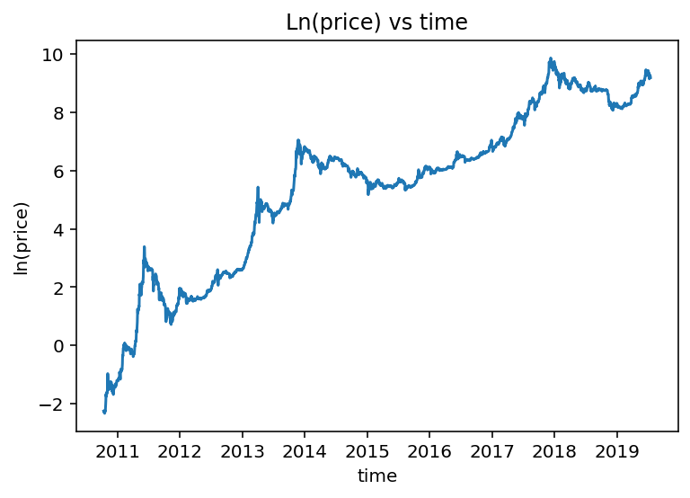

# 📊 **Econometric Study: Impact of Cryptocurrency Volatility on Stock Indices**

This project explores the relationship between **cryptocurrency volatility** (with a focus on **Bitcoin** and **Ethereum**) and traditional stock indices such as the **S&P 500**, **NASDAQ**, and **Dow Jones**. Using advanced econometric models, including **ARCH**, **GARCH**, and **OLS regression**, we aim to analyze the dynamic interactions between these asset classes. Additionally, a separate deep-dive is conducted into the **Bitcoin price** using **time series** models, examining the effectiveness of the **Stock-to-Flow (S2F)** model in explaining price movements.

---

---

## **1. Project Overview**

### **1.1 Problem Statement**
- Since the emergence of cryptocurrencies, their high volatility has presented both risks and opportunities for global financial markets.
- Understanding their potential impact on traditional markets is essential for investors and portfolio managers.

### **1.2 Objectives**
- Analyze whether cryptocurrency returns can predict stock index performance.
- Identify volatility clusters through **ARCH** and **GARCH** models.
- Test for cointegration between **ln(Bitcoin price)** and **ln(S2F)**.
- Provide actionable insights on risk management and diversification strategies.

---

## **2. Methodology**

- **Data**: Historical prices for cryptocurrencies and major stock indices (spanning 4 years).
- **Models Applied**:
    - **ARCH/GARCH** to study volatility behavior.
    - **OLS Regression** to establish relationships between asset returns.
    - **Stationarity tests** (Augmented Dickey-Fuller, Johansen cointegration).
- **Tools**: Python libraries – `numpy`, `pandas`, `statsmodels`, `matplotlib`.

---

## **3. Code Overview**

The complete Python code and dataset are available in the **GitHub repository**.  
📎 [Code and Data Download](btc_code.py)

**Key Steps**:
- Data preprocessing (missing value handling, transformations)
- Visualization of **log(price)** and **log(S2F)** trends over time.
- Time series stationarity checks with **first-order differencing**.
- Regression analysis, including residual and volatility diagnostics.

---

## **4. Key Visualizations**

### **4.1 Ln(Price) vs Time**

- The natural logarithm of Bitcoin's price shows consistent growth with periods of high volatility.

### **4.2 First-order Differences**

- Differencing helps ensure stationarity, a crucial assumption for reliable regression analysis.

### **4.3 Residual Analysis**

- Residuals over time and fitted values indicate a good model fit, with no major patterns violating assumptions.

### **4.4 Fitted vs Actual Values**

- The model successfully captures long-term price trends, although performance varies during volatility peaks.

---

## **5. Key Findings**

- **Bitcoin** and **Ethereum** returns exhibit correlations with the **NASDAQ** index.
- Periods of high crypto volatility often correspond to shifts in capital toward traditional stock markets.
- The **ln(S2F)** model shows a long-term equilibrium relationship with **ln(Bitcoin price)**.
- Stationary residuals and cointegration tests validate the hypothesis of interconnected market dynamics.

---

## **6. Project Structure**

- **Data**: Time-stamped prices for cryptocurrencies and stock indices.
- **Scripts**: Python code for data analysis and model implementation.
- **Visuals**: Plots generated during analysis, saved in the `images` directory.

---

## **7. Conclusion**

This project highlights the growing influence of cryptocurrencies on traditional markets. Their unique volatility patterns require innovative risk management strategies. Understanding these relationships will become increasingly critical for portfolio diversification in the future.

---

### **8. Resources**

- 📄 **Full Report**: [Access the complete analysis in PDF format](crypto_presentation.pdf).  
- 📈 **Source Code**: Clone or download the repository for code and data.  
